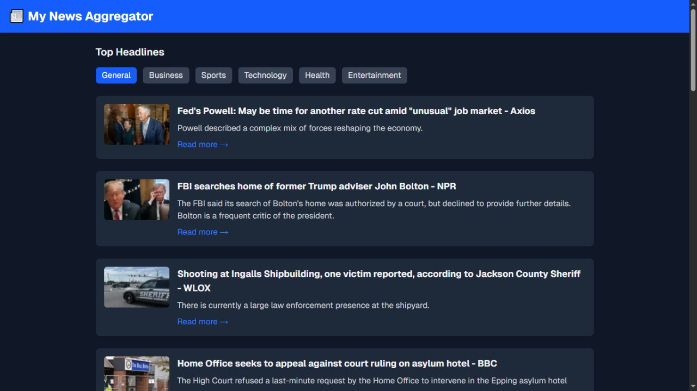
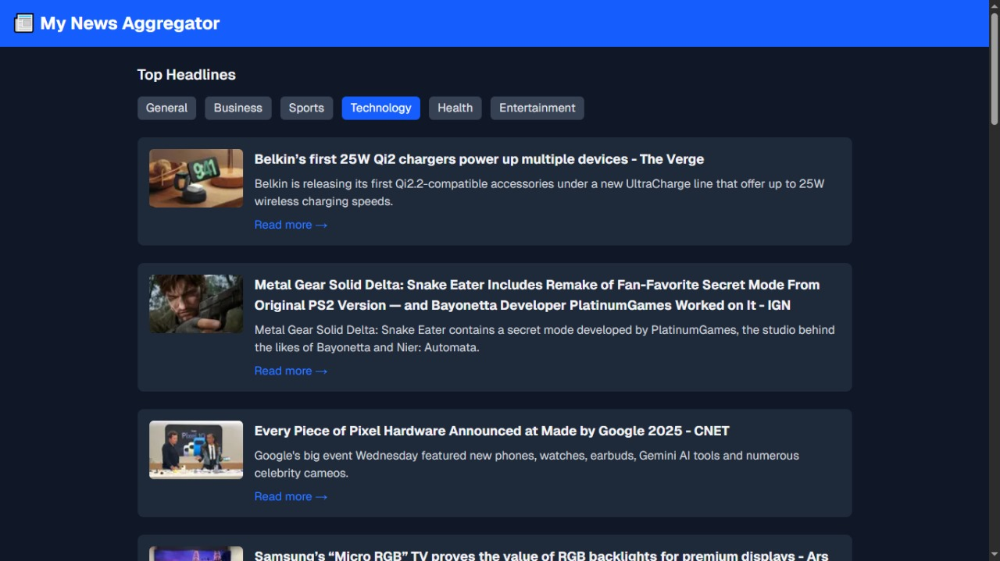
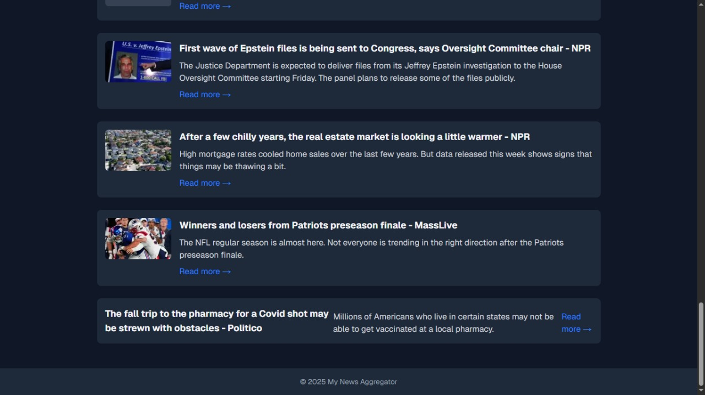
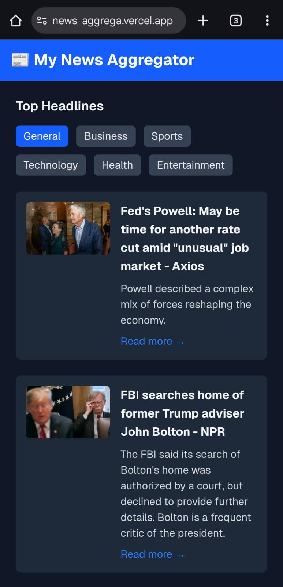
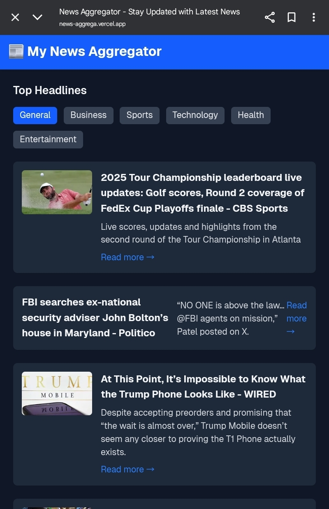

# 📰 News Aggregator

This project was developed as part of my **CodeClause Internship**.  
It is a responsive **News Aggregator Web Application** built with **Next.js, Tailwind CSS, and NewsAPI**.  
The app allows users to browse the latest headlines, filter by categories, and read articles directly from trusted sources.

---

## 📸 Screenshots

### Homepage

### Category Example

### Footer 

### Mobile View

### Tablet View

---

## 🚀 Live Demo

🔗 [View Live Project](https://news-aggrega.vercel.app/)  
🔗 [GitHub Repository](https://github.com/saumya-singh-1/CodeClauseInternship_NewsAggregator)

---

## ✨ Features

- Browse top news headlines
- Filter articles by categories (Business, Sports, Technology, Health, Entertainment, etc.)
- Mobile-friendly responsive UI
- Light/Dark mode ready
- Fetches real-time news using [NewsAPI](https://newsapi.org)

---

## 🛠️ Built With

- [Next.js](https://nextjs.org) (App Router)
- [Tailwind CSS](https://tailwindcss.com)
- [NewsAPI](https://newsapi.org)

---

## 👨‍💻 Author

- **Saumya Singh**  
  GitHub: [@saumya-singh-1](https://github.com/saumya-singh-1)  
  LinkedIn: [@saumyasingh](www.linkedin.com/in/saumya-singh-946b63321/)  

---

## 🎯 Internship Note

This project was built as part of the **CodeClause Internship Program (2025)**.  
It helped me strengthen my skills in **React/Next.js, API integration, and responsive web design**.

